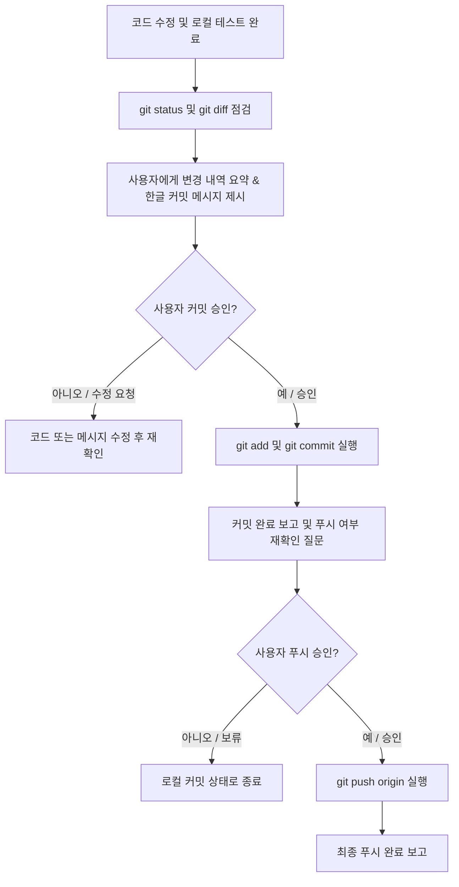

# samjil-git-commit

Git 커밋(`git commit`) 및 푸시(`git push`)를 안전하고 투명하게 수행하기 위한 표준 워크플로 규약입니다.
에이전트는 사용자의 명시적인 사전 허락 없이 절대로 임의로 커밋하거나 푸시해서는 안 됩니다.

---

## 4대 핵심 원칙

1. **사전 승인 필수 (임의 커밋 절대 금지)**
   - 코드 작업이 끝났다고 해서 곧바로 `git commit`을 실행하지 않습니다.
   - 변경된 파일 목록(`git status`), 주요 변경 요약, 그리고 **한글 커밋 메시지**를 사용자에게 먼저 제시하고 명시적인 승인을 구합니다.

2. **커밋 메시지 한글 작성 원칙**
   - 커밋 메시지(comment)는 항상 명확하고 이해하기 쉬운 **한글**로 작성합니다.
   - 접두사는 Conventional Commits(`feat`, `fix`, `refactor`, `docs`, `style`, `test`, `chore`) 형식을 따릅니다.
   - 예시:
     - `feat(viewer): serve-viewer 실행 시 agy 워처 자동 감지 및 기동 기능 추가`
     - `fix(delegate): Windows PowerShell 5.1 한글 인코딩 깨짐 방지를 위한 UTF-8 BOM 복원`
     - `refactor(scripts): 내부 스크립트를 sub/ 폴더로 분리하고 start/stop만 루트 유지`

3. **Commit과 Push 동시 실행 금지 (단계별 분리)**
   - `git commit`과 `git push`를 한 번에 연달아(예: `git commit ... && git push`) 실행하지 않습니다.
   - 반드시 커밋을 먼저 수행하고 결과를 보고한 뒤, **"원격 저장소에 푸시할까요?"**라고 한 번 더 확인(물어보기)을 거칩니다.

4. **최종 승인 시에만 Push 수행**
   - 사용자가 푸시 진행을 명시적으로 승인(허락)했을 때만 `git push`를 실행합니다.
   - 거절하거나 보류하면 로컬 커밋 상태로 안전하게 유지합니다.

---

## 표준 워크플로 절차



### Step 1. 변경 사항 점검 및 한글 커밋 메시지 준비
- `git status`로 변경/추가된 파일을 확인합니다.
- `git diff`로 실제 수정된 코드가 의도한 대로 정확한지 확인합니다.
- 변경 목적을 명확히 설명하는 **한글 커밋 메시지**를 작성합니다.

### Step 2. 사용자에게 커밋 승인 요청 (대기)
사용자에게 아래 형식으로 보고하고 승인을 기다립니다:
> **변경 파일**: `runtime/viewer/serve-viewer.ps1`  
> **변경 요약**: 뷰어 실행 시 워처가 켜져 있지 않으면 자동으로 감지하여 새 콘솔 창으로 띄우는 기능 추가  
> **한글 커밋 메시지**: `feat(viewer): serve-viewer 실행 시 agy 워처 자동 감지 및 기동 기능 추가`  
>  
> 위 내용으로 **`commit`을 진행해도 될까요?**

### Step 3. 승인 시 Commit만 수행
- 사용자가 승인하면 파일을 스테이징하고 커밋합니다:
  ```powershell
  git add <대상파일>
  git commit -m "한글 커밋 메시지"
  ```
- **주의**: 이 단계에서 절대 `git push`를 함께 실행하지 않습니다.

### Step 4. 푸시 진행 여부 확인 요청 (대기)
커밋 완료 후 사용자에게 커밋 해시와 함께 푸시 여부를 질문합니다:
> 로컬 커밋이 완료되었습니다. (`abcd123`)  
> **원격 저장소에 `push`를 진행할까요?**

### Step 5. 승인 시 Push 수행
사용자가 최종 승인하면 푸시를 진행하고 완료 보고를 합니다:
```powershell
git push origin <branch>
```
